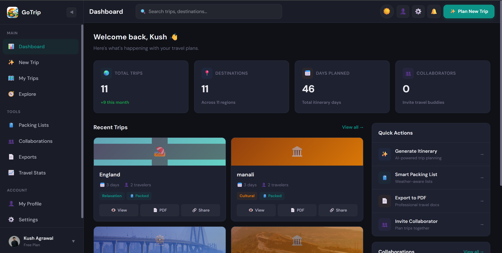
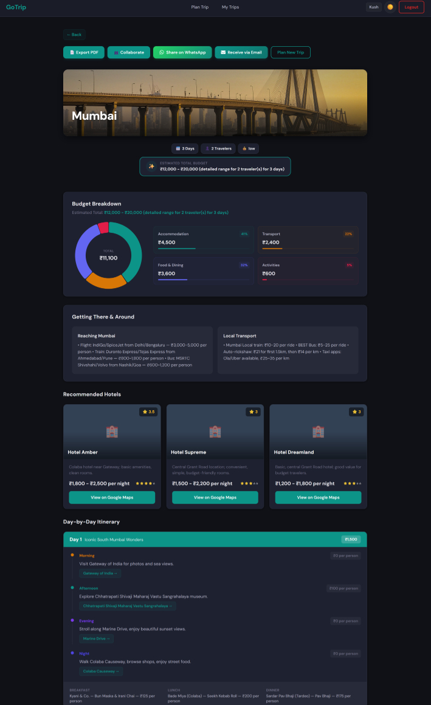

<div align="center">
  

  # 🌍 GoTrip
  **AI-Powered Travel Itinerary Planner & Real-Time Collaboration Platform**

  [](https://mongodb.com/)
  [](https://reactjs.org/)
  [](https://nodejs.org/)
  [](https://socket.io/)
  [](https://deepmind.google/technologies/gemini/)

  <p align="center">
    Plan, collaborate, edit, and share your dream vacations with the power of Artificial Intelligence.
  </p>
</div>

<hr />

## ✨ Features

- 🤖 **AI-Curated Itineraries**: Generate complete, personalized day-by-day itineraries tailored to your travel style, budget, and group size using the **Google Gemini AI API**.

- ✏️ **Inline Itinerary Editing**: Fully editable, hover-triggered React UI to manually tweak AI-generated slots without page reloads.

- 👥 **Real-Time Collaboration**: Invite friends to view, edit, and contribute to the itinerary. Changes sync instantly via **Socket.io**.

- 📊 **Dynamic Dashboard & Analytics**: Track your travel stats, regions visited, collaborator counts, and upcoming trips with animated, responsive UI components.

- 📱 **WhatsApp & Email Sharing**: Instantly share trips via **WhatsApp Click-to-Chat** or beautifully styled **Resend** HTML emails. No account required for recipients!

- 📄 **PDF Export**: Generate professional, formatted PDF versions of your itineraries for offline use.

- 🔒 **Secure Authentication**: Traditional Email/Password (bcrypt + JWT) and seamless **Google OAuth** integration.

- ☁️ **Cloud Media Storage**: Secure, scalable image hosting using **Cloudinary** for user avatars and destination imagery.

---

## 📸 UI Screenshots

<div align="center">

| Dashboard & Analytics | AI Itinerary Generator |
| :---: | :---: |
|  |  |

</div>

---

## 🛠️ Tech Stack

### Frontend (Client)
- **Framework**: React (Vite)
- **State Management**: React Query (TanStack), React Context API
- **Routing**: React Router DOM
- **Styling**: Modern Vanilla CSS + Flexbox/Grid (Glassmorphism, Dark/Light modes)
- **Icons**: React Icons / Custom SVGs

### Backend (Server)
- **Runtime**: Node.js
- **Framework**: Express.js
- **Database**: MongoDB & Mongoose ORM
- **WebSockets**: Socket.io (for live collaboration)
- **Authentication**: JSON Web Tokens (JWT), Passport.js, Google OAuth 2.0

### External APIs & Integrations
- **AI Engine**: Google Gemini API
- **Email Delivery**: Resend API
- **Image Storage**: Cloudinary API
- **Social Sharing**: Meta WhatsApp Click-to-Chat API

---

## 🚀 Getting Started

Follow these instructions to get a copy of the project up and running on your local machine.

### Prerequisites
- Node.js (v18 or higher)
- MongoDB (Local instance or MongoDB Atlas cluster)
- Google Cloud Console Project (for OAuth and Gemini AI keys)
- Resend Account (for email services)
- Cloudinary Account (for image hosting)

### 1. Clone the repository
```bash
git clone https://github.com/yourusername/GoTrip_Udhaan.git
cd GoTrip_Udhaan
```

### 2. Install Dependencies
Install dependencies for both the server and the client.
```bash
# Install Server Dependencies
cd server
npm install

# Install Client Dependencies
cd ../client
npm install
```

### 3. Environment Variables
Create a `.env` file in the **server** directory:
```env
PORT=5000
MONGODB_URI=your_mongodb_connection_string
JWT_SECRET=your_super_secret_key
GEMINI_API_KEY=your_google_gemini_api_key
GOOGLE_CLIENT_ID=your_google_oauth_client_id
CLIENT_URL=http://localhost:5173
FRONTEND_URL=http://localhost:5173

# Resend Service
RESEND_API_KEY=your_resend_api_key
EMAIL_FROM=GoTrip <hello@yourdomain.com>

# Cloudinary
CLOUDINARY_CLOUD_NAME=your_cloudinary_name
CLOUDINARY_API_KEY=your_cloudinary_key
CLOUDINARY_API_SECRET=your_cloudinary_secret
```

Create a `.env` file in the **client** directory:
```env
VITE_API_URL=http://localhost:5000/api
VITE_GOOGLE_CLIENT_ID=your_google_oauth_client_id
```

### 4. Run the Application
You can run the frontend and backend concurrently. 

**Start the Backend Server:**
```bash
cd server
npm run dev
```

**Start the Frontend Client:**
```bash
cd client
npm run dev
```

The client will typically start on `http://localhost:5173` and the server on `http://localhost:5000`.

---

## 📂 Project Structure

```text
GoTrip_Udhaan/
├── client/                     # React Frontend
│   ├── src/
│   │   ├── components/         # Reusable UI components
│   │   ├── context/            # Global state context (Auth, etc.)
│   │   ├── hooks/              # Custom React hooks (React Query)
│   │   ├── pages/              # Route-level components
│   │   ├── services/           # Axios API configuration
│   │   └── index.css           # Global design system & tokens
│   ├── package.json
│   └── vite.config.js
│
├── server/                     # Node.js + Express Backend
│   ├── controllers/            # Route logic and handlers
│   ├── middleware/             # Auth, file upload (Multer) middlewares
│   ├── models/                 # Mongoose Database Schemas (User, Trip)
│   ├── routes/                 # Express API routes
│   ├── services/               # Resend, Cloudinary, Gemini, Sockets
│   ├── server.js               # Entry point
│   └── package.json
└── README.md
```

---

## 🔒 Security Practices
- Passwords are cryptographically hashed using **bcryptjs**.
- Protected API routes using **JWT Authorization Bearer Tokens**.
- Environment variables securely handle all secrets and keys.
- **CORS** configurations strictly mapped to the frontend domain.
- Input validation and rate-limiting to prevent spam requests.

---

## 🤝 Contributing
Contributions, issues, and feature requests are welcome! 
Feel free to check the [issues page](https://github.com/yourusername/GoTrip_Udhaan/issues).

1. Fork the Project
2. Create your Feature Branch (`git checkout -b feature/AmazingFeature`)
3. Commit your Changes (`git commit -m 'Add some AmazingFeature'`)
4. Push to the Branch (`git push origin feature/AmazingFeature`)
5. Open a Pull Request

---

## 📄 License
Distributed under the MIT License. See `LICENSE` for more information.

<div align="center">
  <p>Made with ❤️ by <a href="https://github.com/Kushagrawal1903">Kush Agrawal</a></p>
</div>
